# Simplon Maghreb - Formation DevOps

# Sprint 2 - Semaine 1 - Séance 1 : Fondamentaux et Architecture Docker

## Objectifs pédagogiques

- Comprendre les concepts fondamentaux de la containerisation et ses avantages
- Maîtriser l'architecture Docker et ses composants essentiels
- Manipuler les conteneurs avec les commandes Docker essentielles

## Objectifs techniques

Docker Engine, images vs conteneurs, registry Docker Hub, Dockerfile basics, commandes CLI, lifecycle des conteneurs, architecture client-serveur

## Table des matières

1. [Introduction à la containerisation](#1-introduction-à-la-containerisation)
2. [Architecture Docker](#2-architecture-docker)
3. [Concepts fondamentaux](#3-concepts-fondamentaux)
4. [Commandes Docker essentielles](#4-commandes-docker-essentielles)
5. [Récapitulatif et prochaines étapes](#5-récapitulatif-et-prochaines-étapes)
6. [Ressources complémentaires](#6-ressources-complémentaires)

---

## 1. Introduction à la containerisation

### 1.1 Problématiques traditionnelles

#### Le défi du "ça marche sur ma machine"

Dans le développement logiciel traditionnel, les équipes font face à des défis récurrents :

**Incohérences environnementales** :

- Versions différentes de runtime (Node.js, Python, Java)
- Dépendances système variables selon l'OS
- Configurations réseau et sécurité divergentes
- Variables d'environnement manquantes ou incorrectes

**Complexité du déploiement** :

- Processus manuels sujets aux erreurs
- Documentation de déploiement obsolète
- Rollback difficile en cas de problème
- Tests insuffisants des environnements de production

### 1.2 Solutions traditionnelles et leurs limites

#### Machines virtuelles (VMs)

**Avantages** :

- Isolation complète des systèmes
- Snapshots et restauration facile
- Sécurité renforcée par hyperviseur

**Inconvénients** :

- Overhead important (OS complet par VM)
- Démarrage lent (plusieurs minutes)
- Consommation élevée de ressources
- Complexité de gestion à grande échelle

#### Configuration management

**Outils** : Ansible, Chef, Puppet
**Problèmes persistants** :

- Drift de configuration dans le temps
- Tests difficiles des configurations
- Rollback complexe
- État non reproductible

### 1.3 La révolution des conteneurs

#### Définition de la containerisation

**Containerisation** : Technologie de virtualisation légère qui empaquette une application et toutes ses dépendances dans une unité portable appelée conteneur.

**Principe fondamental** : "Build once, run anywhere"

#### Avantages des conteneurs

**Performance** :

- Partage du noyau de l'OS hôte
- Démarrage en quelques secondes
- Overhead minimal par rapport aux VMs
- Densité élevée (nombreux conteneurs par serveur)

#### Comprendre le partage du noyau

**Principe fondamental** : Contrairement aux machines virtuelles qui embarquent chacune leur propre système d'exploitation complet, **les conteneurs utilisent directement le même noyau (kernel) que l'OS hôte**.

**Architecture des conteneurs** :

```
┌─────────────────────────────────────────────┐
│        Conteneur Ubuntu        │ Conteneur Alpine │
│  ┌─────────────────────────┐   │ ┌─────────────────┐ │
│  │ Applications Ubuntu     │   │ │ Applications    │ │
│  │ Bibliothèques Ubuntu    │   │ │ Bibliothèques   │ │
│  │ Outils Ubuntu          │   │ │ Outils Alpine   │ │
│  └─────────────────────────┘   │ └─────────────────┘ │
├─────────────────────────────────┼─────────────────────┤
│              Docker Engine                           │
├─────────────────────────────────────────────────────┤
│        UN SEUL NOYAU LINUX PARTAGÉ                  │
├─────────────────────────────────────────────────────┤
│             OS Hôte (Ubuntu 20.04)                  │
└─────────────────────────────────────────────────────┘
```

**Démonstration pratique** :

```bash
# Vérifier le noyau de l'hôte
uname -r
# Résultat exemple : 5.15.0-78-generic

# Vérifier le noyau dans un conteneur Ubuntu
docker run -it ubuntu uname -r
# Résultat : 5.15.0-78-generic (IDENTIQUE !)

# Vérifier le noyau dans un conteneur Alpine
docker run -it alpine uname -r
# Résultat : 5.15.0-78-generic (ENCORE IDENTIQUE !)
```

**Ce qui diffère entre conteneurs** :

- **Couches applicatives** : gestionnaires de paquets (apt vs apk)
- **Bibliothèques système** : glibc (Ubuntu) vs musl (Alpine)
- **Outils et utilitaires** : bash vs ash, GNU utils vs BusyBox
- **Configurations** : variables d'environnement, fichiers de config

**Implications importantes** :

- **Compatible** : Conteneurs Linux sur hôte Linux
- **Incompatible** : Conteneurs Windows sur hôte Linux
- **Sécurité** : Vulnérabilité du noyau affecte tous les conteneurs
- **Performance** : Pas de virtualisation matérielle, exécution native

#### Compatibilité des conteneurs et choix d'images

**Principe fondamental** : La compatibilité dépend du **noyau de l'OS hôte**, pas de la distribution Linux choisie pour le conteneur.

**Compatibilité inter-distributions Linux** :

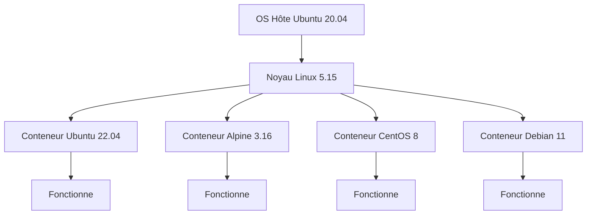

**Incompatibilité entre familles d'OS** :

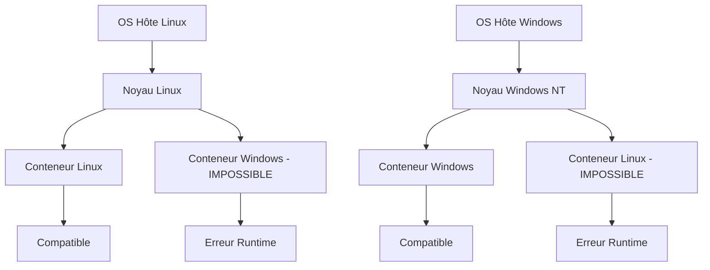

**Choisir son image de base selon l'application** :

La sélection de l'image ne dépend **pas** de l'OS hôte mais des besoins applicatifs :

```bash
# Tous ces conteneurs fonctionnent sur n'importe quel hôte Linux
FROM alpine:3.16          # Image légère (5MB) - Production
FROM ubuntu:22.04         # Image complète (80MB) - Développement
FROM python:3.9-alpine    # Spécialisée Python + Alpine
FROM node:16-slim         # Spécialisée Node.js + Debian minimal
```

**Optimisation selon le contexte** :

- **Production** : Privilégier Alpine (sécurité, taille)
- **Développement** : Ubuntu/Debian (outils, familiarité)
- **CI/CD** : Images officielles avec outils pré-installés

#### Structure en couches (Layers) des conteneurs

**Concept des couches** : Les images Docker sont construites sous forme de **couches superposées** en lecture seule, avec une **couche writable** ajoutée lors de l'exécution du conteneur.

**Architecture en couches** :

```
┌─────────────────────────────────────┐
│     CONTENEUR EN COURS D'EXÉCUTION │
├─────────────────────────────────────┤
│  Couche Writable (Container Layer)  │ ← Modifications temporaires
├─────────────────────────────────────┤
│  Couche Image 4: Application Files  │ ← Lecture seule
├─────────────────────────────────────┤
│  Couche Image 3: Dependencies       │ ← Lecture seule
├─────────────────────────────────────┤
│  Couche Image 2: Runtime            │ ← Lecture seule
├─────────────────────────────────────┤
│  Couche Image 1: Base OS             │ ← Lecture seule
└─────────────────────────────────────┘
```

**Exemple concret avec nginx** :

```
nginx:1.21-alpine
├── alpine:3.14 (couche de base - 5MB)
├── nginx binaries (couche runtime - 15MB)
├── configuration files (couche config - 1MB)
└── default content (couche application - 2MB)
Total image: ~23MB
```

**Avantages des couches** :

1. **Partage efficace** :

```bash
# Si vous avez déjà alpine:3.14, ces images réutilisent la même couche de base
docker pull nginx:alpine    # Réutilise alpine:3.14
docker pull node:alpine     # Réutilise alpine:3.14
docker pull python:alpine   # Réutilise alpine:3.14
```

2. **Builds rapides** :

```bash
# Modification du Dockerfile - seules les couches modifiées sont reconstruites
FROM alpine:3.14           # ← Couche en cache
RUN apk add --no-cache curl # ← Couche en cache
COPY app.js /app/           # ← Seule cette couche est modifiée
```

3. **Déploiements optimisés** :

```bash
# Seules les nouvelles couches sont téléchargées
docker pull myapp:v1.0  # Télécharge toutes les couches
docker pull myapp:v1.1  # Télécharge seulement les couches modifiées
```

**Mécanisme Copy-on-Write** :

- **Lecture** : Accès direct aux couches de l'image
- **Écriture** : Copie du fichier dans la couche writable du conteneur
- **Suppression** : Masquage du fichier (whiteout) dans la couche writable

**Visualisation du partage de couches** :

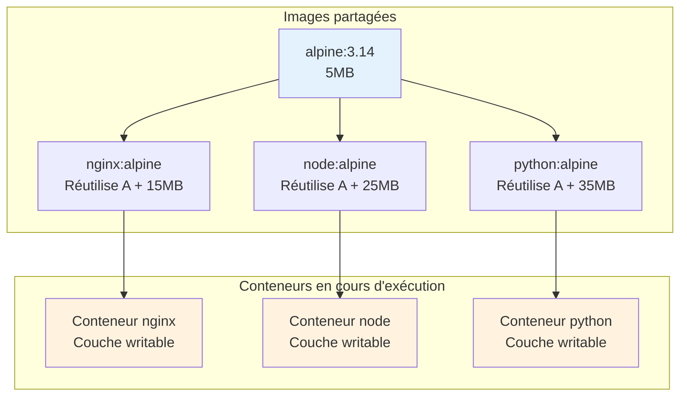

**Optimisation des builds avec cache** :

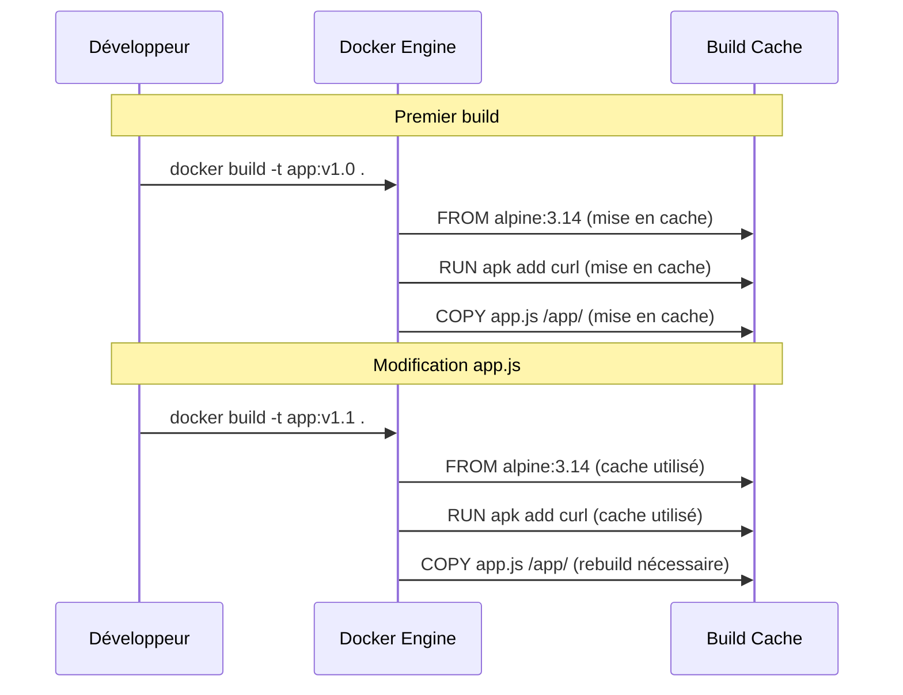

**Commandes pour explorer les couches** :

```bash
# Voir l'historique des couches d'une image
docker history nginx:alpine

# Inspecter les couches détaillées
docker image inspect nginx:alpine

# Analyser l'espace utilisé par les couches
docker system df -v

# Outil avancé pour analyser les couches
# Installation de dive (outil tiers)
docker run --rm -it \
  -v /var/run/docker.sock:/var/run/docker.sock \
  wagoodman/dive:latest nginx:alpine
```

**Portabilité** :

- Même comportement sur laptop, serveur, cloud
- Image immuable et versionnée
- Indépendance vis-à-vis de l'infrastructure

**Évolutivité** :

- Scaling horizontal facilité
- Orchestration automatisée possible
- Gestion déclarative des déploiements

### 1.4 Application pratique - Comparaison VM/Conteneur

**LAB 1** - Installation et premiers pas Docker : `S2_S1_S1_lab1_installation_premiers_pas.md`

**Énoncé du LAB 1** :

Installer Docker Engine et démontrer les avantages des conteneurs face aux VMs traditionnelles.

- **Objectif** : Comprendre l'efficacité des conteneurs vs VMs
- **Contexte** : Mise en place d'un environnement de développement DevOps
- **Instructions** :

  1. Installer Docker Engine selon l'OS
  2. Vérifier l'installation et les composants
  3. Comparer les temps de démarrage VM vs conteneur
  4. Mesurer la consommation de ressources
  5. Tester la portabilité avec plusieurs images

- **Critères d'évaluation** :

  - Installation Docker réussie (2 points)
  - Tests de fonctionnement validés (3 points)
  - Comparaison documentée VM vs conteneur (2 points)
  - Mesures de performance effectuées (1 point)

- **Durée estimée** : 20 minutes
- **Points** : 8/30
- **Fichier de travail** : `S2_S1_S1_lab1_installation_premiers_pas.md`

---

## 2. Architecture Docker

### 2.1 Vue d'ensemble architecturale

#### Architecture client-serveur

Docker utilise une architecture client-serveur composée de :

**Docker Client** :

- Interface en ligne de commande (CLI)
- Envoie les commandes au Docker Daemon
- Peut communiquer avec des daemons distants

**Docker Daemon (dockerd)** :

- Service qui s'exécute en arrière-plan
- Gère les images, conteneurs, réseaux, volumes
- Expose une API REST pour la communication

**Docker Registry** :

- Stockage centralisé des images Docker
- Docker Hub par défaut (public)
- Registries privés possibles (Harbor, ECR, ACR)

**Architecture complète Docker** :

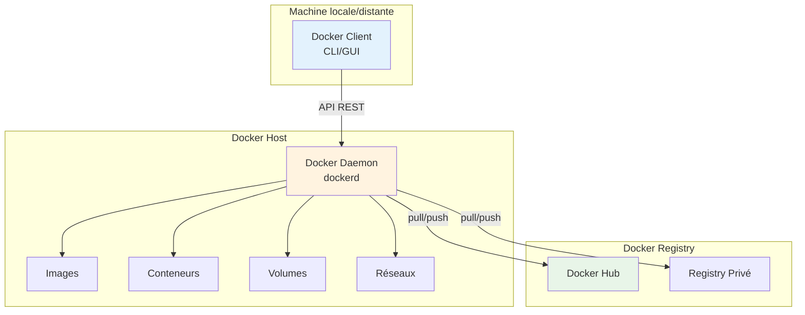

**Flux de travail typique** :

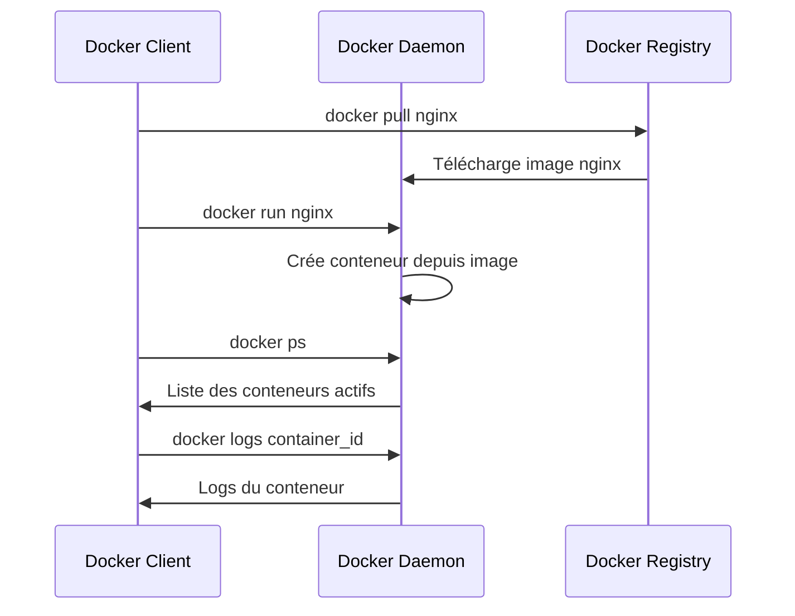

### 2.2 Composants essentiels

#### Images Docker

**Définition** : Template en lecture seule utilisé pour créer des conteneurs.

**Caractéristiques** :

- Structure en couches (layers)
- Immuables une fois créées
- Partage de couches entre images
- Versioning avec tags

**Format** : `registry/namespace/repository:tag`
Exemple : `docker.io/library/nginx:1.21-alpine`

#### Conteneurs

**Définition** : Instance exécutable d'une image Docker.

**Cycle de vie** :

1. **Created** : Conteneur créé mais pas démarré
2. **Running** : Conteneur en cours d'exécution
3. **Paused** : Conteneur mis en pause
4. **Stopped** : Conteneur arrêté proprement
5. **Exited** : Conteneur terminé (avec code de sortie)
6. **Deleted** : Conteneur supprimé

#### Dockerfile

**Définition** : Fichier texte contenant les instructions pour construire une image.

**Instructions principales** :

```dockerfile
FROM ubuntu:20.04           # Image de base
WORKDIR /app               # Répertoire de travail
COPY . .                   # Copier fichiers
RUN apt-get update         # Exécuter commandes
EXPOSE 80                  # Exposer port
CMD ["nginx"]              # Commande par défaut
```

### 2.3 Écosystème Docker

#### Docker Desktop

**Composants** :

- Docker Engine
- Docker CLI
- Docker Compose
- Interface graphique
- Kubernetes (optionnel)

**Avantages** :

- Installation simplifiée
- Gestion graphique
- Intégration IDE
- Debugging facilité

#### Docker Desktop et compatibilité cross-platform

**Le "paradoxe" des conteneurs Linux sur Windows/macOS** :

Docker Desktop résout l'incompatibilité OS en utilisant une **machine virtuelle Linux cachée** :

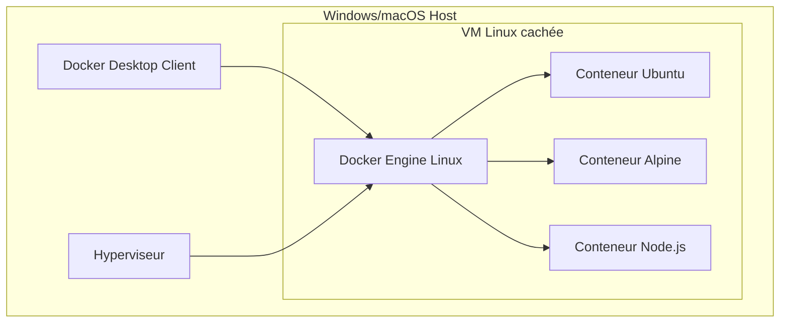

**Architecture détaillée selon l'OS** :

**Windows 10/11 Pro (Hyper-V)** :

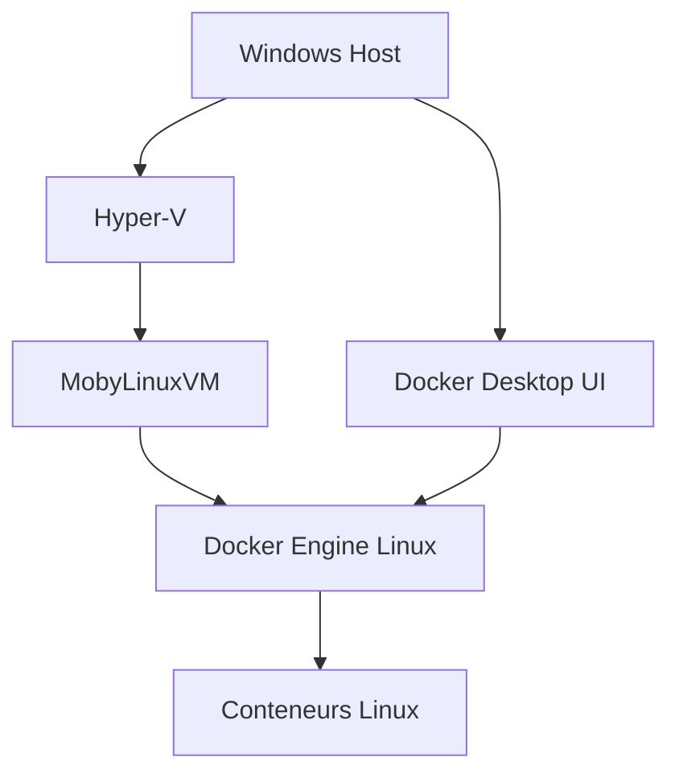

**Windows 10/11 Home (WSL2)** :

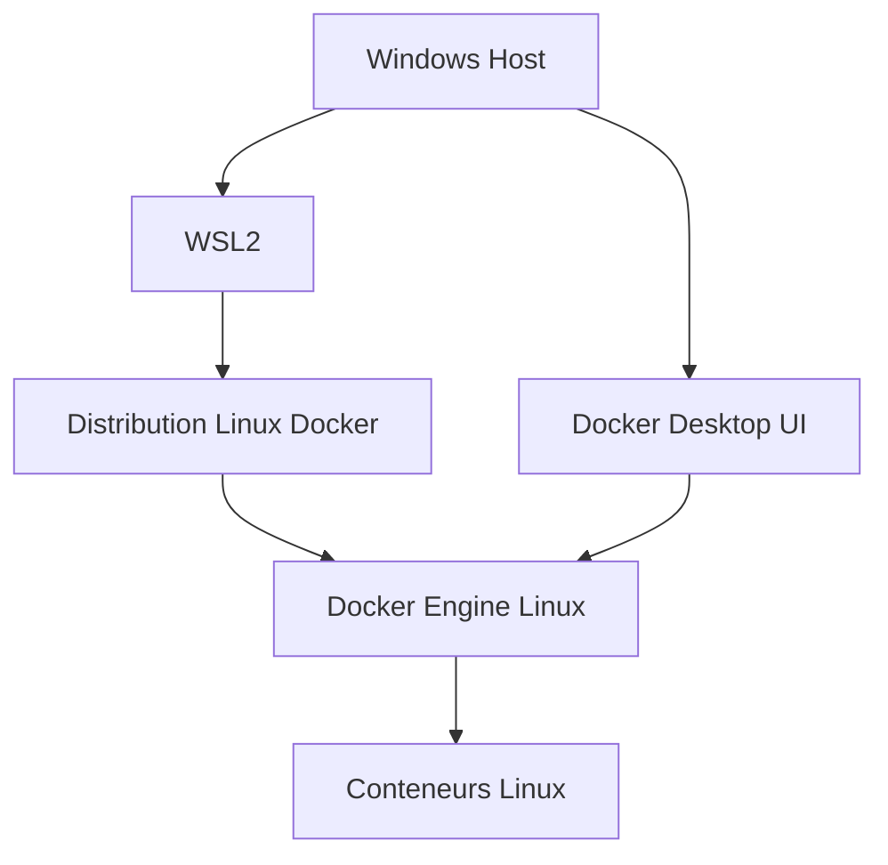

**macOS** :

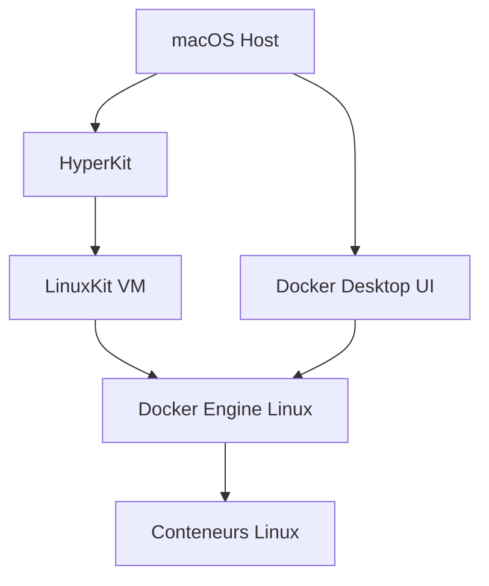

**Démonstration pratique** :

```bash
# Sur Windows/macOS avec Docker Desktop - Révéler la VM cachée
docker run --rm -it --privileged --pid=host ubuntu nsenter -t 1 -m -u -n -i sh

# Vous entrez dans la VM Linux cachée !
uname -a
# Linux docker-desktop 5.15.49-linuxkit ...

# C'est le vrai hôte Linux des conteneurs
ps aux | grep docker
```

**Implications développement vs production** :

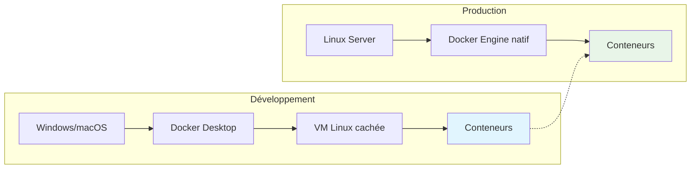

**Points clés** :

- Docker Desktop = Interface unifiée + VM Linux cachée
- Performance légèrement réduite par la virtualisation
- Expérience développement transparente
- Migration production sans modification du code

#### Docker Hub

**Services** :

- Registry public d'images
- Images officielles vérifiées
- Automated builds depuis Git
- Webhooks et intégrations

### 2.4 Application pratique - Architecture

**LAB 2** - Manipulation de conteneurs et images : `S2_S1_S1_lab2_manipulation_conteneurs.md`

**Énoncé du LAB 2** :

Explorer l'architecture Docker en manipulant images et conteneurs pour une stack de développement.

- **Objectif** : Maîtriser les composants Docker fondamentaux
- **Contexte** : Création d'un environnement de développement pour équipe DevOps
- **Instructions** :

  1. Explorer Docker Hub et télécharger images officielles
  2. Analyser la structure en couches des images
  3. Créer et gérer le cycle de vie de conteneurs
  4. Inspecter les métadonnées et configurations
  5. Utiliser les logs et le monitoring de base
  6. Créer une première image personnalisée

- **Critères d'évaluation** :

  - Images téléchargées et analysées (2 points)
  - Gestion du cycle de vie conteneurs (4 points)
  - Inspection et monitoring (2 points)
  - Image personnalisée créée (2 points)

- **Durée estimée** : 25 minutes
- **Points** : 10/30
- **Fichier de travail** : `S2_S1_S1_lab2_manipulation_conteneurs.md`

---

## 3. Concepts fondamentaux

### 3.1 Isolation et sécurité des conteneurs

#### Comprendre les Linux Namespaces

**Définition** : Les namespaces Linux sont un mécanisme du noyau qui isole et virtualise les ressources système pour un groupe de processus.

**Principe fondamental** : Chaque conteneur Docker voit un environnement système complet et isolé, même s'il partage le même noyau que l'hôte.

#### Types de namespaces utilisés par Docker

**1. PID Namespace** : Isolation des processus

```bash
# Dans l'hôte
ps aux | head -5
# PID  PPID  CMD
#   1     0  /sbin/init
# 123   456  dockerd
# 789   123  containerd

# Dans un conteneur
docker run -it ubuntu ps aux
# PID  PPID  CMD
#   1     0  bash        ← Le processus bash a le PID 1 dans le conteneur !
```

**Implications** :

- Chaque conteneur a son propre arbre de processus
- Le processus principal du conteneur a toujours le PID 1
- Les processus du conteneur ne voient pas les processus de l'hôte
- Kill d'un processus dans un conteneur n'affecte pas l'hôte

**2. NET Namespace** : Isolation réseau

```bash
# Interface réseau de l'hôte
ip addr show
# 1: lo: <LOOPBACK,UP,LOWER_UP>
# 2: eth0: <BROADCAST,MULTICAST,UP,LOWER_UP>
# 3: docker0: <BROADCAST,MULTICAST,UP,LOWER_UP>

# Interface réseau dans un conteneur
docker run -it ubuntu ip addr show
# 1: lo: <LOOPBACK,UP,LOWER_UP>     ← Interface loopback isolée
# 8: eth0: <BROADCAST,MULTICAST,UP,LOWER_UP>  ← Interface virtuelle
```

**Mécanisme** :

- Chaque conteneur a sa propre pile réseau TCP/IP
- Interfaces réseau virtuelles connectées via des bridges
- Tables de routage et règles iptables isolées
- Ports isolés (même port peut être utilisé dans différents conteneurs)

**3. MNT Namespace** : Isolation du système de fichiers

```bash
# Système de fichiers de l'hôte
df -h
# /dev/sda1        50G   20G   28G  42% /
# /dev/sda2       100G   10G   85G  11% /home

# Système de fichiers dans un conteneur
docker run -it ubuntu df -h
# overlay         50G   20G   28G  42% /
# tmpfs           64M      0   64M   0% /dev
# tmpfs          494M      0  494M   0% /sys/fs/cgroup
```

**Caractéristiques** :

- Système de fichiers racine isolé pour chaque conteneur
- Montages indépendants et invisibles depuis l'hôte
- Union filesystem avec couches read-only et writable
- Volumes partagés possibles avec montages explicites

**4. UTS Namespace** : Isolation hostname et domainname

```bash
# Hostname de l'hôte
hostname
# docker-host

# Hostname dans un conteneur
docker run -it --name test-container ubuntu hostname
# a1b2c3d4e5f6    ← ID unique généré automatiquement

# Hostname personnalisé
docker run -it --hostname myapp ubuntu hostname
# myapp
```

**5. IPC Namespace** : Isolation communication inter-processus

**Mécanismes isolés** :

- Shared memory segments (SHM)
- Message queues
- Semaphores
- POSIX message queues

```bash
# Voir les IPC de l'hôte
ipcs -a

# Voir les IPC dans un conteneur (isolés)
docker run -it ubuntu ipcs -a
```

**6. USER Namespace** : Isolation des utilisateurs et groupes

```bash
# Mapping des utilisateurs hôte vers conteneur
docker run -it --user 1000:1000 ubuntu id
# uid=1000 gid=1000

# Root dans le conteneur = utilisateur normal sur l'hôte
docker run -it ubuntu id
# uid=0(root) gid=0(root)  ← Root dans le conteneur seulement
```

**Sécurité** :

- L'utilisateur root du conteneur n'est pas root sur l'hôte
- Mapping des UID/GID pour éviter les escalades de privilèges
- Isolation des permissions et droits d'accès

#### Démonstration pratique des namespaces

```bash
# Lancer un conteneur avec inspection des namespaces
docker run -d --name demo-ns nginx:alpine
CONTAINER_PID=$(docker inspect --format '{{.State.Pid}}' demo-ns)

# Voir les namespaces du conteneur
sudo ls -la /proc/$CONTAINER_PID/ns/
# lrwxrwxrwx 1 root root 0 net:[4026532169]
# lrwxrwxrwx 1 root root 0 pid:[4026532170]
# lrwxrwxrwx 1 root root 0 mnt:[4026532167]
# lrwxrwxrwx 1 root root 0 uts:[4026532168]
# lrwxrwxrwx 1 root root 0 ipc:[4026532171]

# Comparer avec les namespaces de l'hôte
sudo ls -la /proc/1/ns/
# Les IDs sont différents → isolation confirmée
```

#### Control Groups (cgroups) - Limitation des ressources

**Définition** : Les cgroups contrôlent et limitent l'utilisation des ressources système par les processus.

**Architecture des cgroups** :

```
                    Root Cgroup (/)
                         │
           ┌─────────────┼─────────────┐
           │             │             │
    CPU Controller  Memory Controller  IO Controller
           │             │             │
    ┌──────┴──────┐     │             │
    │             │     │             │
Container-A  Container-B │             │
   (50% CPU)   (50% CPU) │             │
                         │             │
                  ┌──────┴──────┐     │
                  │             │     │
             Container-A    Container-B │
              (512MB)        (1GB)      │
                                       │
                                ┌──────┴──────┐
                                │             │
                           Container-A    Container-B
                            (100MB/s)      (200MB/s)
```

#### Types de limitations cgroups

**1. CPU Controller**

```bash
# Limiter à 50% d'un CPU
docker run -d --cpus="0.5" nginx:alpine

# Limiter à 2 CPUs spécifiques
docker run -d --cpuset-cpus="0,1" nginx:alpine

# Priorité CPU (weight)
docker run -d --cpu-shares=512 nginx:alpine  # Priorité réduite
docker run -d --cpu-shares=1024 nginx:alpine # Priorité normale
```

**Vérification** :

```bash
# Voir l'usage CPU en temps réel
docker stats --no-stream
# CONTAINER  CPU %    MEM USAGE / LIMIT
# nginx      0.50%    2.5MB / 512MB
```

**2. Memory Controller**

```bash
# Limiter la mémoire RAM
docker run -d --memory="512m" nginx:alpine

# Limiter RAM + Swap
docker run -d --memory="512m" --memory-swap="1g" nginx:alpine

# Désactiver le swap
docker run -d --memory="512m" --memory-swap="512m" nginx:alpine
```

**Comportement OOM (Out of Memory)** :

```bash
# Test de dépassement mémoire
docker run -it --memory="100m" ubuntu bash -c "
  yes | tr \\n x | head -c 200m > /dev/null
"
# Résultat : Killed (conteneur terminé par OOM killer)
```

**3. Block I/O Controller**

```bash
# Limiter les opérations de lecture/écriture par seconde
docker run -d --device-read-iops /dev/sda:1000 nginx:alpine
docker run -d --device-write-iops /dev/sda:1000 nginx:alpine

# Limiter la bande passante
docker run -d --device-read-bps /dev/sda:10mb nginx:alpine
docker run -d --device-write-bps /dev/sda:10mb nginx:alpine
```

**4. Network Controller** (si configuré)

```bash
# Limiter la bande passante réseau (nécessite tc)
docker run -d --cap-add=NET_ADMIN nginx:alpine
docker exec container_id tc qdisc add dev eth0 root tbf rate 1mbit burst 32kbit latency 400ms
```

#### Inspection et monitoring des cgroups

```bash
# Voir la hiérarchie cgroups d'un conteneur
CONTAINER_ID=$(docker ps -q --filter "name=demo")
docker exec $CONTAINER_ID cat /proc/1/cgroup
# 12:memory:/docker/a1b2c3d4e5f6...
# 11:cpu,cpuacct:/docker/a1b2c3d4e5f6...
# 10:blkio:/docker/a1b2c3d4e5f6...

# Voir les limites appliquées
docker exec $CONTAINER_ID cat /sys/fs/cgroup/memory/memory.limit_in_bytes
# 536870912  (512MB en bytes)

# Monitoring en temps réel
docker stats --format "table {{.Container}}\t{{.CPUPerc}}\t{{.MemUsage}}\t{{.NetIO}}"
```

#### Sécurité et bonnes pratiques

**Principe de moindre privilège** :

```bash
# Éviter de run en root
docker run -it --user 1000:1000 ubuntu bash

# Utiliser des images non-root
FROM nginx:alpine
RUN addgroup -g 1001 -S nginx
RUN adduser -S -D -H -u 1001 -h /var/cache/nginx -s /sbin/nologin -G nginx nginx
USER nginx
```

**Limitations de sécurité** :

```bash
# Limiter les capabilities
docker run -d --cap-drop=ALL --cap-add=NET_BIND_SERVICE nginx:alpine

# Mode read-only
docker run -d --read-only --tmpfs /tmp nginx:alpine

# Désactiver les nouveaux privilèges
docker run -d --security-opt=no-new-privileges nginx:alpine
```

#### Visualisation de l'isolation

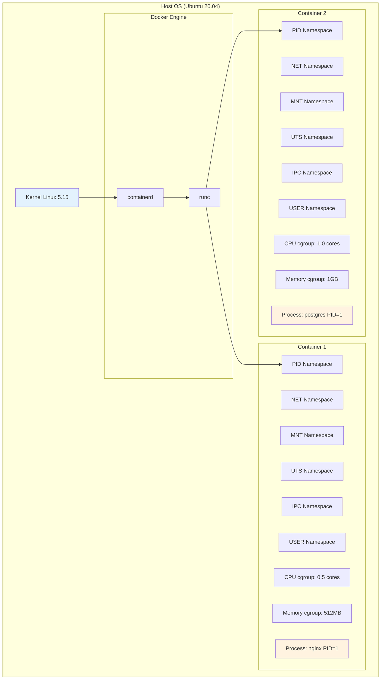

### 3.2 Images vs Conteneurs

#### Images Docker

**Nature** : Templates immuables en lecture seule

**Stockage** : Layers superposés avec copy-on-write

**Partage** : Layers communes partagées entre images

**Versioning** : Tags pour identifier les versions

**Exemple de structure** :

```
nginx:1.21-alpine
├── alpine:3.14 (base layer)
├── nginx binary installation
├── configuration files
└── default content
```

#### Conteneurs

**Nature** : Instances exécutables d'images

**État** : Couche writable ajoutée à l'image

**Isolation** : Namespaces et cgroups Linux

**Temporalité** : Éphémères par design

### 3.3 Registries et distribution

#### Docker Hub

**Images officielles** :

- Maintenues par Docker Inc.
- Security scanning automatique
- Documentation complète
- Mises à jour régulières

**Exemple d'images officielles** :

- `nginx` : Serveur web haute performance
- `postgres` : Base de données relationnelle
- `redis` : Cache et message broker
- `node` : Runtime JavaScript
- `python` : Interpréteur Python

#### Registries privés

**Solutions** :

- Harbor (CNCF project)
- AWS ECR (Elastic Container Registry)
- Azure ACR (Azure Container Registry)
- Google GCR (Google Container Registry)
- GitLab Container Registry

#### Stratégies de déploiement cross-platform

**Principe fondamental** : Une image Docker est spécifique à une famille d'OS, mais plusieurs stratégies permettent de gérer la compatibilité.

**1. Images multi-architecture (même OS, différentes CPU)** :

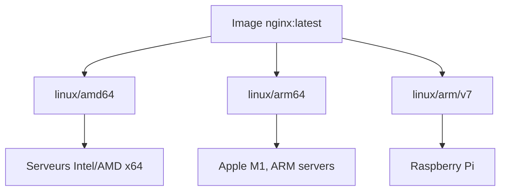

**2. Images séparées par OS** :

```bash
# Stratégie : Images distinctes avec conventions de nommage
docker build -t monapp:1.0-linux -f Dockerfile.linux .
docker build -t monapp:1.0-windows -f Dockerfile.windows .

# Structure projet cross-platform
mon-projet/
├── src/                    # Code source partagé
│   └── app.py
├── docker/
│   ├── Dockerfile.linux    # Image Linux
│   └── Dockerfile.windows  # Image Windows
└── docker-compose.yml
```

**3. Docker Manifest pour la transparence** :

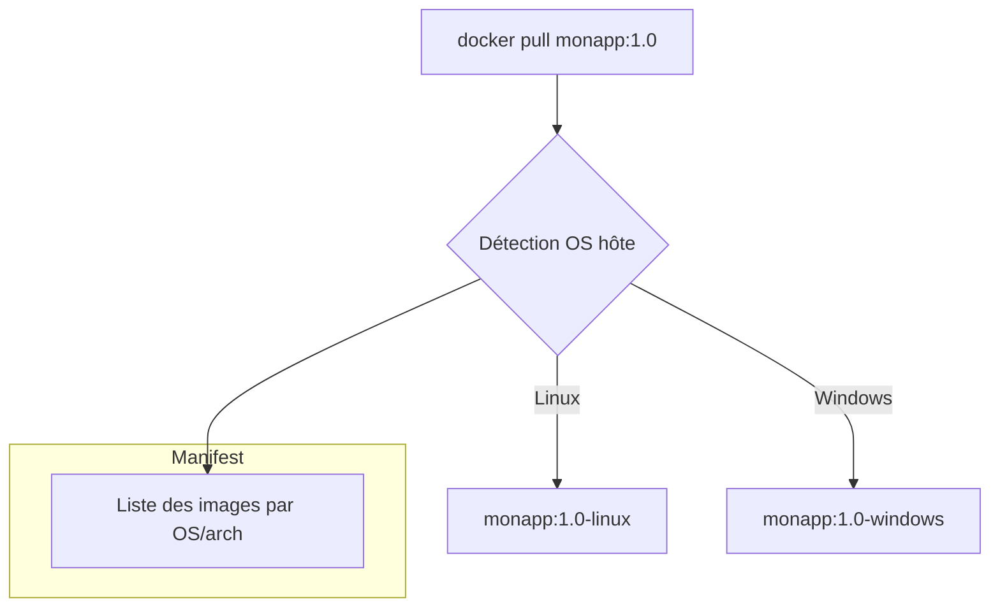

**Exemple pratique Application Node.js** :

```dockerfile
# Dockerfile.linux
FROM node:18-alpine
WORKDIR /app
COPY package*.json ./
RUN npm install
COPY . .
EXPOSE 3000
CMD ["npm", "start"]
```

```dockerfile
# Dockerfile.windows
FROM mcr.microsoft.com/windows/servercore:ltsc2022
SHELL ["powershell", "-Command"]
# Installation Node.js Windows...
WORKDIR C:\app
COPY package*.json ./
RUN npm install
COPY . .
EXPOSE 3000
CMD ["npm", "start"]
```

**CI/CD avec build matrix** :

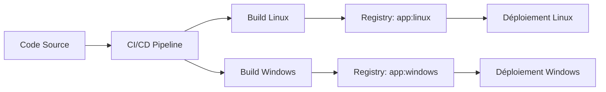

### 3.4 Filesystem et stockage

#### Union Filesystem

**Principe** : Superposition de couches en lecture seule + une couche writable

**Avantages** :

- Partage efficient entre conteneurs
- Images légères par réutilisation
- Déploiements rapides
- Rollback facile

#### Storage drivers

**overlay2** (recommandé) :

- Performance optimale
- Support des hard links
- Métadonnées efficientes

**Autres drivers** :

- `aufs` : Legacy, plus maintenu
- `devicemapper` : Red Hat/CentOS 7
- `btrfs` : Experimental
- `zfs` : Experimental

---

## 4. Commandes Docker essentielles

### 4.1 Gestion des images

#### Recherche et téléchargement

```bash
# Rechercher une image sur Docker Hub
docker search nginx

# Télécharger une image
docker pull nginx:1.21-alpine
docker pull postgres:13

# Lister les images locales
docker images
docker image ls

# Informations détaillées sur une image
docker image inspect nginx:1.21-alpine

# Historique des couches
docker image history nginx:1.21-alpine
```

#### Construction et gestion

```bash
# Construire une image depuis un Dockerfile
docker build -t mon-app:v1.0 .
docker build -t mon-app:latest --file Dockerfile.prod .

# Tag et renommage
docker tag mon-app:v1.0 mon-app:latest
docker tag mon-app:v1.0 myregistry.io/mon-app:v1.0

# Suppression d'images
docker image rm nginx:1.21-alpine
docker rmi $(docker images -q --filter "dangling=true")

# Nettoyage
docker image prune -a
```

### 4.2 Gestion des conteneurs

#### Création et exécution

```bash
# Exécution simple
docker run nginx
docker run -d nginx  # En arrière-plan (detached)
docker run -it ubuntu bash  # Interactif avec TTY

# Configuration réseau et ports
docker run -d -p 80:80 nginx
docker run -d -p 8080:80 --name web-server nginx

# Variables d'environnement
docker run -d -e POSTGRES_PASSWORD=secret postgres:13
docker run -d --env-file .env postgres:13

# Volumes et montages
docker run -d -v /host/data:/container/data postgres:13
docker run -d -v $(pwd):/app -w /app node:16 npm start
```

#### Monitoring et gestion

```bash
# Lister les conteneurs
docker ps                    # Conteneurs actifs
docker ps -a                 # Tous les conteneurs
docker ps --filter "status=running"

# Informations détaillées
docker inspect container-name
docker stats container-name

# Logs et debugging
docker logs container-name
docker logs -f container-name  # Suivi en temps réel
docker logs --since "2023-01-01" container-name

# Exécution de commandes dans un conteneur
docker exec -it container-name bash
docker exec container-name ls -la /app
```

#### Contrôle du cycle de vie

```bash
# Arrêt et démarrage
docker stop container-name
docker start container-name
docker restart container-name

# Pause et reprise
docker pause container-name
docker unpause container-name

# Suppression
docker rm container-name
docker rm -f container-name  # Force la suppression
docker container prune       # Supprime tous les conteneurs arrêtés
```

### 4.3 Commandes de maintenance

#### Surveillance système

```bash
# Utilisation de l'espace disque
docker system df
docker system df -v  # Détaillé

# Événements en temps réel
docker system events
docker system events --filter "container=web-server"

# Informations système complètes
docker system info
```

#### Nettoyage et optimisation

```bash
# Nettoyage complet
docker system prune          # Images, conteneurs, réseaux non utilisés
docker system prune -a       # + images non référencées
docker system prune --volumes # + volumes non utilisés

# Nettoyage sélectif
docker container prune        # Conteneurs arrêtés
docker image prune           # Images danglings
docker network prune         # Réseaux non utilisés
docker volume prune          # Volumes non utilisés
```

### 4.4 Application pratique - Commandes avancées

**LAB 3** - Application multi-conteneurs avec communication : `S2_S1_S1_lab3_application_multi_conteneurs.md`

**Énoncé du LAB 3** :

Déployer une application web complète avec base de données en utilisant les commandes Docker avancées.

- **Objectif** : Maîtriser les commandes Docker pour des déploiements complexes
- **Contexte** : Stack d'application DevOps avec frontend, backend et base de données
- **Instructions** :

  1. Déployer PostgreSQL avec persistance et configuration
  2. Créer un réseau personnalisé pour l'isolation
  3. Déployer une application Node.js connectée à PostgreSQL
  4. Ajouter un proxy Nginx pour la haute disponibilité
  5. Configurer les logs et le monitoring
  6. Tester la communication inter-conteneurs
  7. Implémenter des health checks

- **Critères d'évaluation** :

  - Base de données PostgreSQL fonctionnelle (3 points)
  - Application Node.js déployée et connectée (3 points)
  - Proxy Nginx configuré (2 points)
  - Communication inter-conteneurs validée (2 points)
  - Monitoring et logs configurés (1 point)
  - Health checks implémentés (1 point)

- **Durée estimée** : 35 minutes
- **Points** : 12/30
- **Fichier de travail** : `S2_S1_S1_lab3_application_multi_conteneurs.md`

---

## 5. Récapitulatif et prochaines étapes

### Points clés de la séance

**Concepts fondamentaux** :

- Containerisation comme évolution des VMs
- Architecture client-serveur Docker
- Images immuables et conteneurs éphémères
- Isolation par namespaces et cgroups

**Compétences pratiques** :

- Installation et configuration Docker Engine
- Commandes essentielles pour images et conteneurs
- Gestion du cycle de vie des applications
- Debugging et monitoring de base

**Bonnes pratiques** :

- Utilisation d'images officielles
- Configuration du daemon Docker
- Limitation des ressources
- Nettoyage régulier du système

### Préparation séance suivante

La **Séance 2 - Création d'Images avec Dockerfile** s'appuiera sur ces bases pour :

- Maîtriser la syntaxe Dockerfile complète
- Optimiser la taille et sécurité des images
- Implémenter des builds multi-stage
- Utiliser BuildKit et les fonctionnalités avancées

### Validation des acquis

- Installation Docker réussie sur différents OS
- Maîtrise des commandes CRUD pour images/conteneurs
- Compréhension de l'architecture et des composants
- Capacité à déployer des applications multi-conteneurs

---

## 6. Ressources complémentaires

### Documentation officielle

- [Docker Documentation](https://docs.docker.com/)
- [Docker Best Practices](https://docs.docker.com/develop/dev-best-practices/)
- [Docker Security](https://docs.docker.com/engine/security/)

### Outils et extensions

- **Dive** : Analyse des couches d'images
- **Hadolint** : Linter pour Dockerfile
- **Docker Bench Security** : Audit de sécurité
- **Portainer** : Interface graphique de gestion

### Lectures approfondies

- Container runtimes (containerd, CRI-O, runc)
- OCI (Open Container Initiative) specifications
- Security scanning et vulnerability management
- Performance tuning et optimisation

---

_Formateur : Hassan ESSADIK | Sprint 2 - Semaine 1 - Séance 1_
